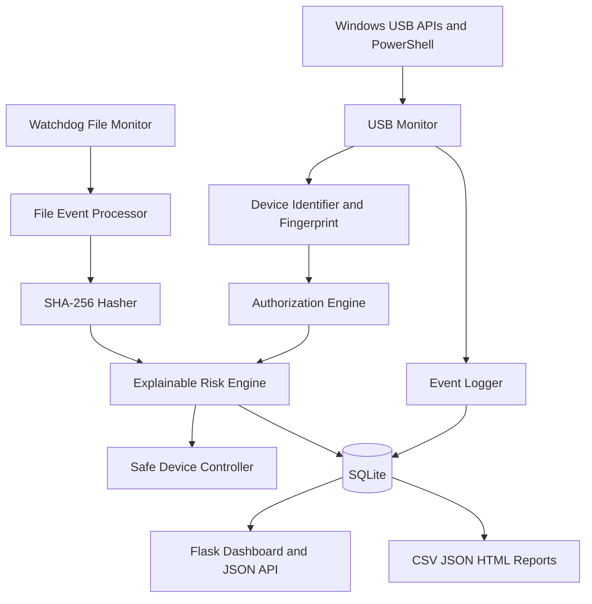

# USB Device Control & Monitoring Framework

Version 1.0.0 | Defensive Endpoint Security | Microsoft Windows

## Abstract

This project is a locally running blue-team endpoint monitoring framework for USB device visibility, authorization policy, explainable risk scoring, file activity auditing, alerts, and reporting. It is designed for authorized systems and academic demonstration.

## Safety and honesty

The default enforcement mode is `SIMULATION`. It never changes Windows device state and reports `SIMULATED BLOCK` rather than claiming a block occurred. Real enforcement is intentionally unavailable until a documented, verified Windows device-management adapter is added. The application will report `BLOCK_FAILED` instead of pretending success. File-system notifications cannot always prove copy direction, so uncertain activity is labeled `DIRECTION_UNCERTAIN`. Executables, large transfers, and sensitive extensions are indicators, not proof of malware or theft.

## Architecture



## Current modules

- `config.py`: environment-driven paths, thresholds, and simulation setting.
- `database/`: SQLAlchemy models for devices, USB events, file events, policies, alerts, and audit logs.
- `core/device_identifier.py`: Windows PowerShell discovery, normalization, and stable SHA-256 identity.
- `core/authorization.py`: allowlist/blocklist policy matching.
- `core/risk_engine.py`: transparent 0-100 rules and risk levels.
- `core/device_controller.py`: administrator detection and safe enforcement boundary.
- `core/usb_monitor.py`: background polling abstraction.
- `core/file_monitor.py`: watchdog events and streaming SHA-256 hashing.
- `routes/api.py`: dashboard JSON endpoints and policy creation.
- `core/report_generator.py`: JSON, CSV, and HTML exports.

## Installation

PowerShell from the project root:

```powershell
python -m venv .venv
.venv\Scripts\Activate.ps1
python -m pip install --upgrade pip
pip install -r requirements.txt
python scripts/initialize_database.py
```

`pywin32` and `WMI` are installed on Windows. On another platform, Windows scanning safely returns no devices.

## Running

```powershell
python app.py
```

Open `http://127.0.0.1:5000/`. The dashboard refreshes its counters and event table through AJAX. The health endpoint is `http://127.0.0.1:5000/api/health`.

## Demo mode

Generate clearly marked demo records:

```powershell
python scripts/generate_demo_data.py
```

Every generated device, event, file event, and alert has `DEMO DATA` metadata or `is_demo=true`. Demo data does not claim to be a real USB event.

## Real USB scan

```powershell
python scripts/scan_usb_devices.py
```

The scanner uses PowerShell `Get-PnpDevice` on Windows. Missing fields are printed as `UNKNOWN`; the tool does not invent serial numbers, drives, authorization, or risk scores.

## Reports

```powershell
python scripts/generate_report.py --format json
python scripts/generate_report.py --format csv
python scripts/generate_report.py --format html
```

Files are written under `data/exports` or `data/reports`.

## Testing

```powershell
pytest -q
```

Core tests use temporary files and mock-independent services, so a physical USB device is not required.

## API

- `GET /api/devices`
- `GET /api/events`
- `GET /api/file-events`
- `GET /api/alerts`
- `GET /api/statistics`
- `GET /api/policies`
- `POST /api/policies/allow` with JSON `{ "value": "fingerprint-or-id" }`
- `POST /api/policies/block` with JSON `{ "value": "fingerprint-or-id" }`

## Security concepts demonstrated

Endpoint security, device fingerprinting, access control, allowlisting, blocklisting, security event logging, file integrity monitoring, rule-based risk assessment, incident detection, data-loss-prevention indicators, auditability, and blue-team operations.

## Limitations and future work

USB identity values are not perfect anti-spoofing controls. Identity anomalies should be investigated, not treated as guaranteed spoofing. Watchdog observes filesystem changes but does not provide perfect Windows copy attribution. Administrator privileges may be required for future real device management. Future work can add authenticated administrator sessions, CSRF-protected management forms, richer WMI storage correlation, Windows device-property verification, and an independently validated real enforcement adapter.

## Ethical use

Use only on systems you own or are authorized to monitor. This project contains no credential theft, persistence, evasion, exploit delivery, destructive action, or covert surveillance functionality.
